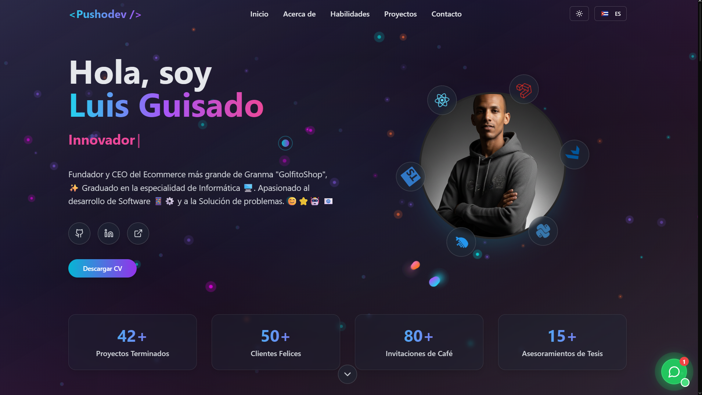

# Portfolio Personal - PushoDev

[](https://github.com/PushoDev/pushodev-portfolio)

## Descripción

Portfolio personal de Luis Alberto Guisado Lavañino (PushoDev), un desarrollador Full-Stack apasionado por crear soluciones digitales que marquen la diferencia. El proyecto es una aplicación de una sola página construida con React, TypeScript y animaciones personalizadas, con soporte bilingüe (español/inglés) y conmutación de tema oscuro/claro.

## Características

- 🎨 **Diseño moderno y responsivo**
- 🌍 **Soporte bilingüe (Español/Inglés)**
- 🌙 **Modo claro/oscuro**
- 🚀 **Animaciones fluidas y efectos visuales**
- 👆 **Cursor personalizado con efecto de aurora**
- 📱 **Diseño completamente responsive**
- 🔧 **Sistema de construcción personalizado con esbuild**

## Tecnologías

- **Frontend**: React, TypeScript
- **Estilos**: Tailwind CSS
- **Animaciones**: Framer Motion
- **UI Components**: Componentes estilo Shadcn con Radix UI
- **Iconos**: Lucide React
- **Construcción**: esbuild
- **Despliegue**: Vercel

## Vista Previa



## Proyectos Destacados

- 🔹 **Portfolio React & TypeScript + Tailwindcss** – Portfolio Personal
- 🔹 **FastAPI + React & Typescripts Dashboard** – Panel administrativo con autenticación y estadísticas
- 🔹 **Sistema de Gestión de Almacenes (Laravel + Reactsx)** – Solución completa para manejo de productos y almacenes (Maqueta)
- 🔹 **E-commerce Multivendedor (WordPress)** – Plataforma escalable y segura
- 🔹 **App Móvil Flutter + Firebase** – Aplicación en tiempo real con chat y notificaciones
- 🔹 **Drone Med (Nest + PostgreSQL's)** – API REST Full para Drones de transporte medicamentos

## Instalación Local

1. Clona el repositorio:

```bash
git clone https://github.com/PushoDev/pushodev-portfolio.git
```

2. Instala las dependencias:

```bash
npm install
```

3. Inicia el servidor de desarrollo:

```bash
npm run dev
```

4. Abre tu navegador en `http://localhost:8000`

## Contribuciones

Las contribuciones son bienvenidas. Siéntete libre de abrir un issue o enviar un pull request para mejorar este portfolio.

## Despliegue en Vivo

Puedes ver este portfolio en vivo en: [https://pushodev.vercel.app](https://pushodev.vercel.app)

## Autor

**Luis Alberto Guisado Lavañino** (PushoDev)

- GitHub: [PushoDev](https://github.com/PushoDev)
- Portfolio: [https://pushodev.vercel.app](https://pushodev.vercel.app)
